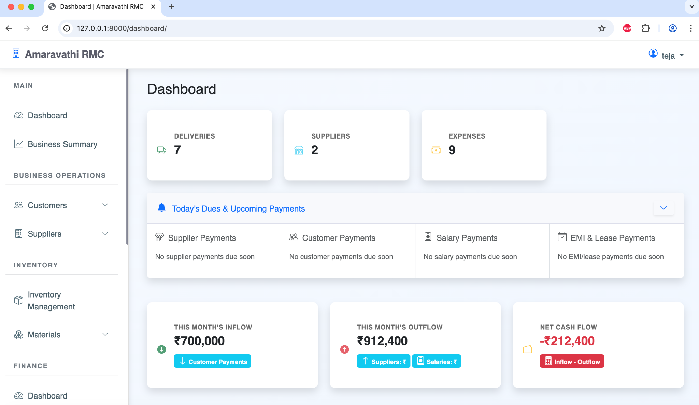
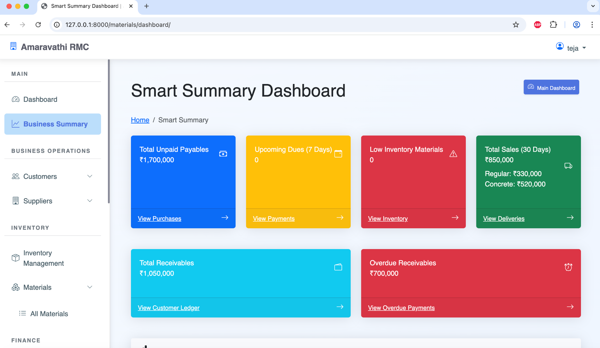
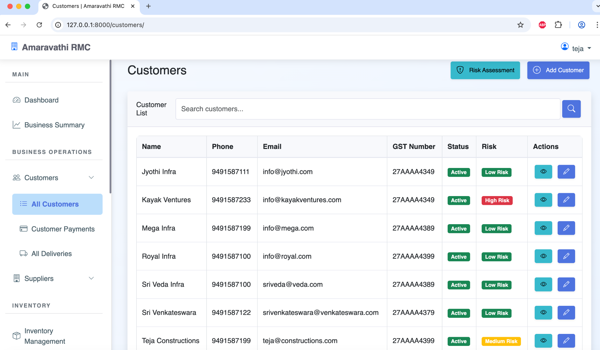
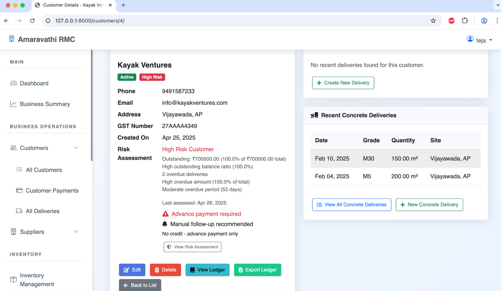
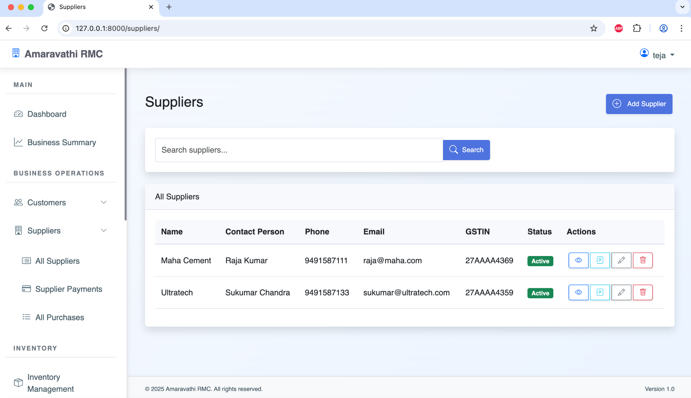
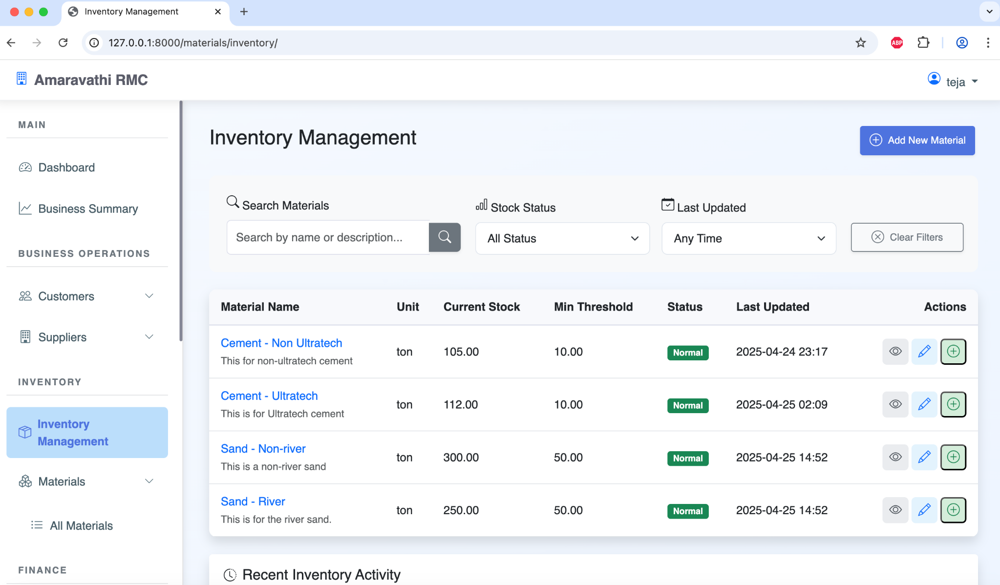
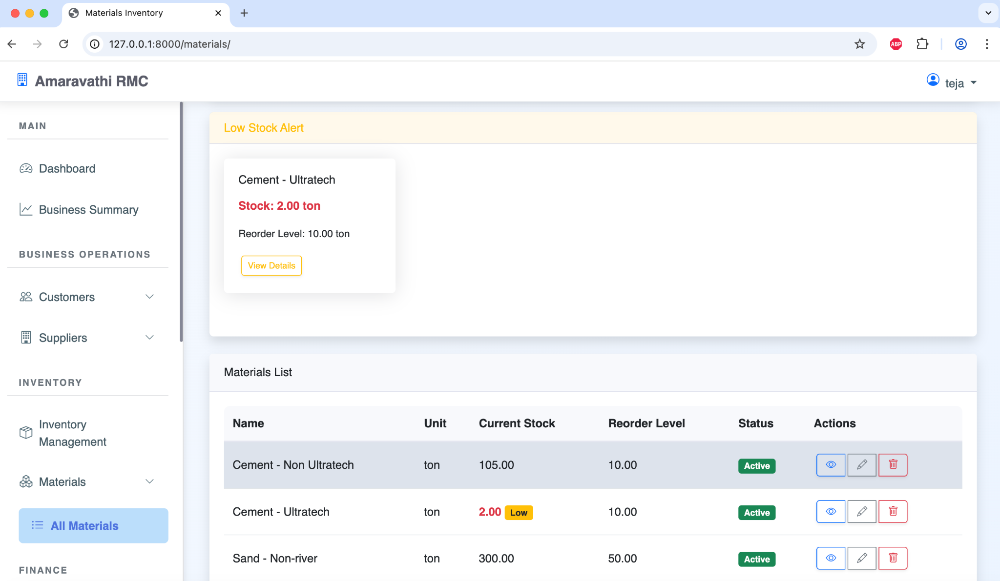
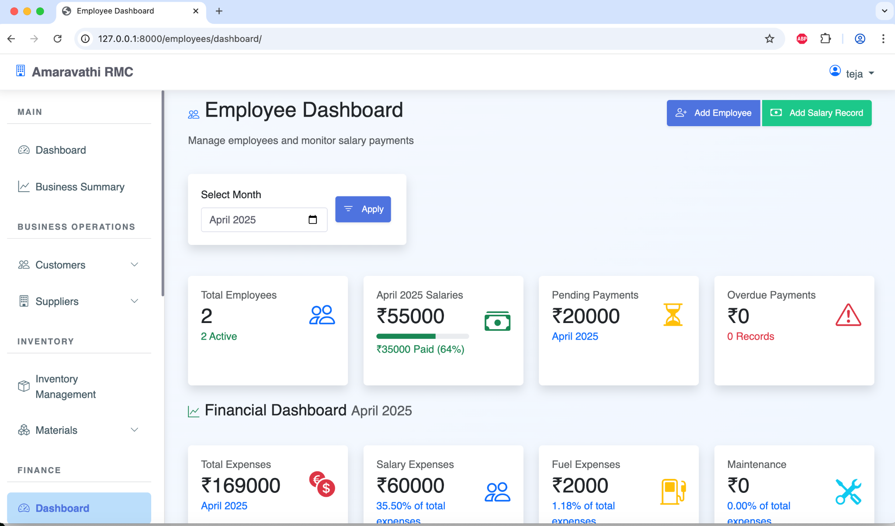
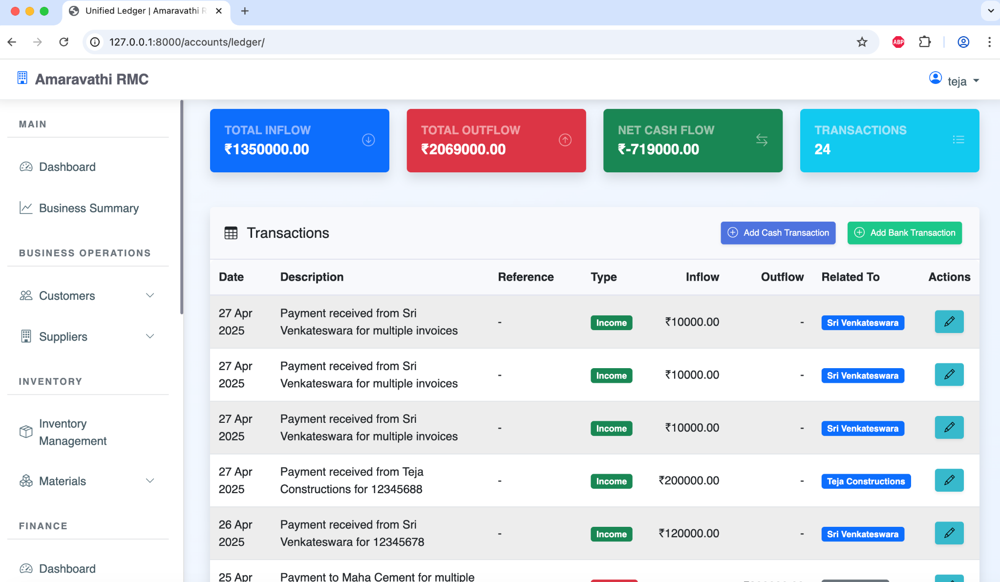

# Amaravathi RMC Management System

A comprehensive Django-based management system for Ready-Mix Concrete (RMC) business operations. This system streamlines the management of customers, suppliers, deliveries, expenses, employee salaries, and financial records.

<details>
  <summary>📸 Click here to view Amaravathi RMBMP Screenshots</summary>

  ### Main Dashboard
  

  ### Business Summary Dashboard
  

  ### Customer List
  

  ### Customer Details
  

  ### Suppliers and Purchases
  

  ### Inventory Management
  

  ### Low Stock Alerts
  

  ### Employee Dashboard
  

  ### Unified Ledger
  

</details>

## Features

- **User Management**: Role-based authentication with three access levels (Admin, Accountant, Viewer)
- **Customer Management**: Track customer information, delivery locations, and credit history
- **Delivery Tracking**: Schedule and monitor concrete deliveries, status updates, and delivery receipts
- **Supplier Management**: Manage suppliers, purchase orders, and supply chain
- **Material Inventory**: Track concrete materials, specifications, and stock levels
- **Expense Tracking**: Categorize and record business expenses with supporting documentation
- **Employee Management**: Maintain employee records and process salaries
- **Financial Management**: Comprehensive ledger, transaction tracking, and bank reconciliation
- **Reporting System**: Generate standard and custom reports for business insights
- **RESTful API**: Integration capabilities for third-party applications

## Tech Stack

- **Backend**: Django 5.x, Python 3.9+
- **Frontend**: Bootstrap 5, JavaScript (ES6)
- **Database**: PostgreSQL (production), SQLite (development)
- **File Storage**: Local filesystem or Supabase
- **Deployment**: Supports Docker, Render, any WSGI-compatible server
- **Security**: HTTPS enforcement, CSRF protection, password policies

## Documentation

Comprehensive documentation is available in the [docs](docs/) directory:

- [User Guide](docs/user_guide.md) - Complete guide for system users
- [Quick Start Guide](docs/quick_start_guide.md) - Essential information for new users
- [Installation Guide](docs/installation_guide.md) - Detailed setup instructions
- [Developer Guide](docs/development_guide.md) - Guide for developers working with the codebase
- [Architecture Overview](docs/architecture.md) - System architecture and design principles
- [API Documentation](docs/api_docs.md) - REST API reference for system integration
- [FAQ](docs/faq.md) - Answers to frequently asked questions

## Deployment Options

### Option 1: Docker Deployment (Recommended)

#### Prerequisites
- [Docker](https://docs.docker.com/get-docker/)
- [Docker Compose](https://docs.docker.com/compose/install/)

#### Development Environment

1. Clone the repository:
   ```bash
   git clone https://github.com/teja499-tech/amaravathi-rmcms.git
   cd amaravathi-rmcms
   ```

2. Run the setup script for development:
   ```bash
   ./docker-setup.sh dev
   ```

3. Edit the .env file with your specific settings if needed.

4. Access the application at http://localhost:8000

#### Production Environment

1. Clone the repository:
   ```bash
   git clone https://github.com/teja499-tech/amaravathi-rmcms.git
   cd amaravathi-rmcms
   ```

2. Copy the environment example file and configure it:
   ```bash
   cp env.docker.example .env
   ```

3. Edit the .env file with your production settings:
   - Set secure DB_PASSWORD and SECRET_KEY values
   - Configure your DOMAIN
   - Add SUPABASE settings if using Supabase for file storage
   - Configure email settings

4. Run the setup script for production:
   ```bash
   ./docker-setup.sh
   ```

5. Set up SSL with Let's Encrypt:
   ```bash
   # Replace yourdomain.com with your actual domain
   docker-compose run --rm certbot certonly --webroot -w /var/www/certbot -d yourdomain.com -d www.yourdomain.com
   ```

6. Restart the services:
   ```bash
   docker-compose down
   docker-compose up -d
   ```

7. Access your application via your domain.

### Option 2: Local Development Setup

1. Clone the repository:
   ```bash
   git clone https://github.com/teja499-tech/amaravathi-rmcms.git
   cd amaravathi-rmcms
   ```

2. Create a virtual environment and activate it:
   ```bash
   python -m venv venv
   source venv/bin/activate  # On Windows: venv\Scripts\activate
   ```

3. Install dependencies:
   ```bash
   pip install -r requirements.txt
   ```

4. Create a .env file using the template:
   ```bash
   cp env.example .env
   ```
   
5. Update the .env file with your settings.

6. Run migrations:
   ```bash
   python manage.py migrate
   ```

7. Create a superuser:
   ```bash
   python manage.py createsuperuser
   ```

8. Run the development server:
   ```bash
   python manage.py runserver
   ```

The application will be available at http://127.0.0.1:8000/

### Option 3: Deployment on Render

#### Step 1: Set up a Render account
Sign up at [render.com](https://render.com/) if you don't have an account.

#### Step 2: Create a new Web Service
1. Click "New" and select "Web Service"
2. Connect to your GitHub repository
3. Use the following settings:
   - **Name**: amaravathi-rmc (or your preferred name)
   - **Environment**: Python
   - **Build Command**: `pip install -r requirements.txt`
   - **Start Command**: `gunicorn amaravathi_rmbmp.wsgi:application`

#### Step 3: Configure Environment Variables
Add the following environment variables:
- `DEBUG`: False
- `SECRET_KEY`: Generate a secure random string
- `ALLOWED_HOSTS`: your-app.onrender.com (and other domains if needed)
- `DATABASE_URL`: Will be automatically set if you create a PostgreSQL database

#### Step 4: Create a PostgreSQL Database
1. Go to "Dashboard" and click "New" again
2. Select "PostgreSQL"
3. Choose your plan
4. After creation, get the connection string for the DATABASE_URL

#### Step 5: Deploy
Click "Deploy" and wait for the build to complete.

## Docker Commands

### Common Docker Commands

- Start the application:
  ```bash
  docker-compose up -d
  ```

- Stop the application:
  ```bash
  docker-compose down
  ```

- View logs:
  ```bash
  docker-compose logs -f web
  ```

- Run migrations:
  ```bash
  docker-compose exec web python manage.py migrate
  ```

- Create a superuser:
  ```bash
  docker-compose exec web python manage.py createsuperuser
  ```

- Restart a specific service:
  ```bash
  docker-compose restart web
  ```

- Rebuild containers after code changes:
  ```bash
  docker-compose up -d --build
  ```

## System Architecture

The system follows a modular design approach with clear separation of concerns:

- **User Interface Layer**: Role-specific UIs (Admin, Accountant, Viewer)
- **Application Layer**: Django Views, Business Logic, API Endpoints
- **Data Access Layer**: Django ORM, Model Managers, Data Services
- **Infrastructure Layer**: Database, File Storage, Cache System

For more details on the system architecture, see the [Architecture Overview](docs/architecture.md).

## API Integration

The system provides a RESTful API for integration with other applications. The API includes endpoints for:

- Customer management
- Delivery tracking
- Supplier management
- Financial transactions
- Reporting

For complete API documentation, refer to the [API Documentation](docs/api_docs.md).

## Health Check

The application provides a health check endpoint at `/health/` which returns a JSON response with:
- Overall status
- Database connection status
- Application version

## Contributing

Contributions are welcome! Please see the [Developer Guide](docs/development_guide.md) for information on how to contribute to this project.

## Support

For support, please:
- Check the [FAQ](docs/faq.md) for answers to common questions
- Refer to the [User Guide](docs/user_guide.md) for detailed instructions
- Contact support@amaravathirmc.com for technical assistance

## License

[MIT License](LICENSE) 